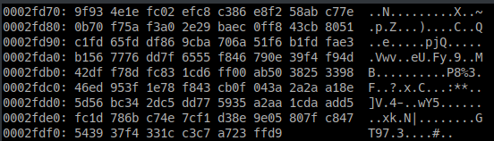

# Laporan

## SOAL 1

Meng-unzip file .zip ke dalam sebuah folder:

```bash
unzip /home/durianpeople/Downloads/nature.zip -d /home/durianpeople/Downloads
```

Membuat folder **nature2** untuk menampung hasil dekripsi file-file:

```bash
mkdir /home/durianpeople/Downloads/nature2
```

Konten dari salah satu file dalam folder **nature** adalah sebagai berikut:


Karena terlihat seperti hasil dari enkripsi base64, maka didekripsi sehingga menghasilkan output berikut:



Bentuk output hexdump, sehingga harus di-reverse untuk mendapatkan binary file

Loop untuk setiap file dalam folder **nature**, *decrypt* menggunakan Base64 kemudian melakukan reverse hexdump menggunakan xxd

```bash
for i in `ls /home/durianpeople/Downloads/nature/`; do 
	base64 -d /home/durianpeople/Downloads/nature/$i | 
	xxd -r > /home/durianpeople/Downloads/nature2/$i; 
done
```

## SOAL 2


## SOAL 3

## SOAL 4

## SOAL 5

